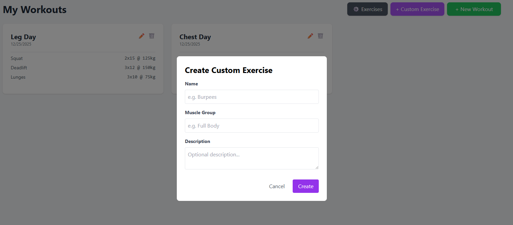
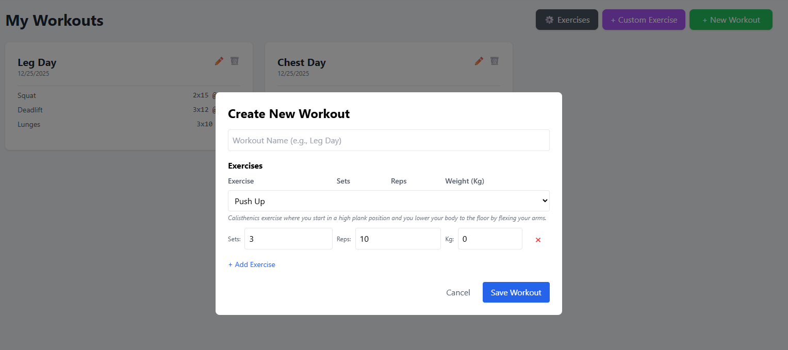

# 🏋️ Workout Tracker

A full-stack web application for tracking workouts, managing custom exercises, and monitoring fitness progress. Built with **Spring Boot 3** and **Vanilla JS + Tailwind CSS**.

> 💡 Inspired by the [Fitness Workout Tracker](https://roadmap.sh/projects/fitness-workout-tracker) project idea from roadmap.sh.

## ✨ Features

### 🔐 Authentication & Security
*   **Secure Sign Up & Login**: JWT (JSON Web Token) based authentication.
*   **Role-Based Access**: Data isolation ensures users only see their own workouts and custom exercises.
*   **Stateless Architecture**: Scalable and secure session management.

### 🏋️ Workout Management
*   **Create Workouts**: Build custom workout plans with multiple exercises.
*   **Track Progress**: Log sets, reps, and weight for every exercise.
*   **Edit & Update**: Modify existing workouts (change names, add/remove exercises).
*   **Delete**: Remove old workouts with a confirmation modal.

### 📚 Exercise Library
*   **System Exercises**: Comes pre-loaded with standard exercises (Push Up, Squat, Pull Up).
*   **Custom Exercises**: Users can create their own private exercises (e.g., "Burpees").
*   **Manage Library**: View all exercises and delete custom ones (System exercises are protected).

### 🎨 Modern UI/UX
*   **Responsive Design**: Works on desktop and mobile (Tailwind CSS).
*   **Single Page Application (SPA)**: Fast, seamless transitions without page reloads.
*   **Interactive Elements**:
    *   Toast Notifications for success/error messages.
    *   Smooth animations for adding rows and modals.
    *   Clean, modal-based forms for better usability.

## 🛠️ Tech Stack

### Backend
*   **Java 17**
*   **Spring Boot 3** (Web, Data JPA, Security, Validation)
*   **PostgreSQL** (Database)
*   **Lombok** (Boilerplate reduction)
*   **Docker** (Containerization)

### Frontend
*   **HTML5**
*   **Tailwind CSS** (Styling)
*   **Vanilla JavaScript** (Logic & API Integration)

## 🚀 Getting Started

### Prerequisites
*   **Docker Desktop** (for the database)
*   **Java 17 SDK**

### Installation

1.  **Clone the repository**
    ```bash
    git clone https://github.com/your-username/workout-tracker.git
    cd workout-tracker
    ```

2.  **Start the Database**
    ```bash
    docker compose up -d
    ```

3.  **Run the Application**
    ```bash
    ./mvnw spring-boot:run
    ```

4.  **Access the App**
    Open your browser and go to:
    👉 **http://localhost:8080/index.html**

## 🔌 API Endpoints

| Method | Endpoint | Description |
| :--- | :--- | :--- |
| **POST** | `/api/v1/auth/register` | Create a new account |
| **POST** | `/api/v1/auth/authenticate` | Login and get JWT |
| **GET** | `/api/v1/workouts` | Get all user workouts |
| **POST** | `/api/v1/workouts` | Create a new workout |
| **PUT** | `/api/v1/workouts/{id}` | Update a workout |
| **DELETE** | `/api/v1/workouts/{id}` | Delete a workout |
| **GET** | `/api/v1/exercises` | Get all available exercises |
| **POST** | `/api/v1/exercises` | Create a custom exercise |
| **DELETE** | `/api/v1/exercises/{id}` | Delete a custom exercise |

## 📸 Screenshots

### 1. User Dashboard

*The main hub where users can view their workout history, create new plans, and manage exercises.*

### 2. Creating a Workout

*A dynamic modal form allows users to add multiple exercises, sets, reps, and weights. Note the exercise description updates automatically.*

### 3. Custom Exercises

*Users can extend the system library by creating their own custom exercises with specific muscle groups.*

### 4. Managing the Library

*A dedicated view to manage all exercises. System exercises are locked (🔒), while custom ones can be deleted (🗑️).*

### 5. Secure Authentication

*Secure login and registration pages protected by JWT authentication.*

### 6. Safety Features

*Confirmation modals prevent accidental deletion of workouts or exercises.*

## 🤝 Contributing

1.  Fork the project
2.  Create your feature branch (`git checkout -b feature/AmazingFeature`)
3.  Commit your changes (`git commit -m 'Add some AmazingFeature'`)
4.  Push to the branch (`git push origin feature/AmazingFeature`)
5.  Open a Pull Request
